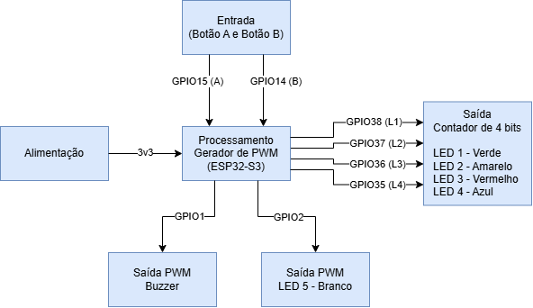
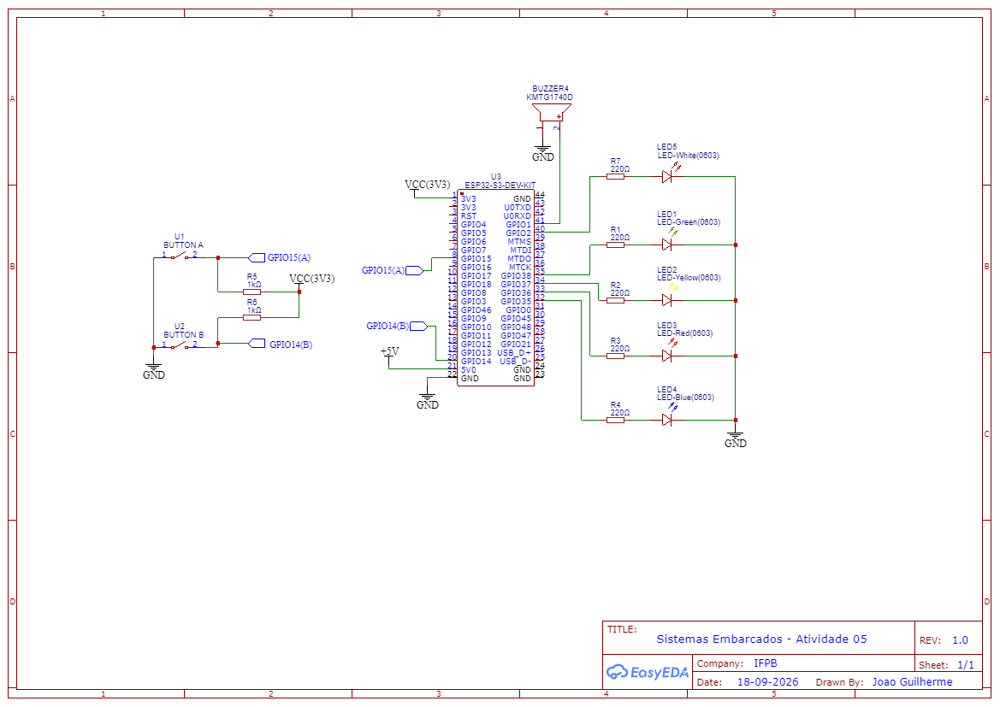
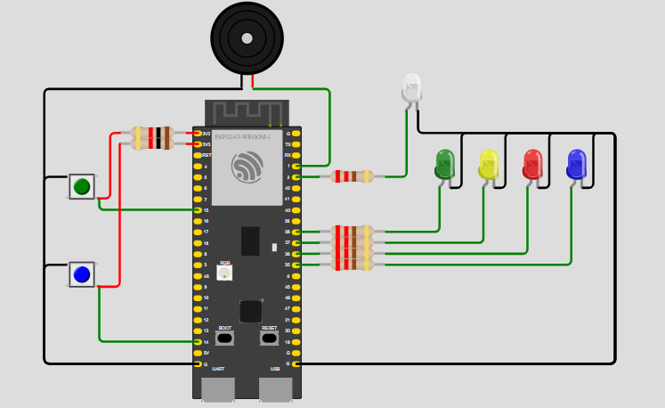

# Atividade 05

## Diagrama de Blocos

Ferramenta utilizada: [Draw.io](https://app.diagrams.net/)

## Esquemático

Ferramenta utilizada: [EasyEDA](https://easyeda.com/)

## Simulação e Código

[Link para Simulação com Código no WOLKI](https://wokwi.com/projects/475419474572370945)

Ferramenta Utilizada: [WOLKI](https://wokwi.com/)

